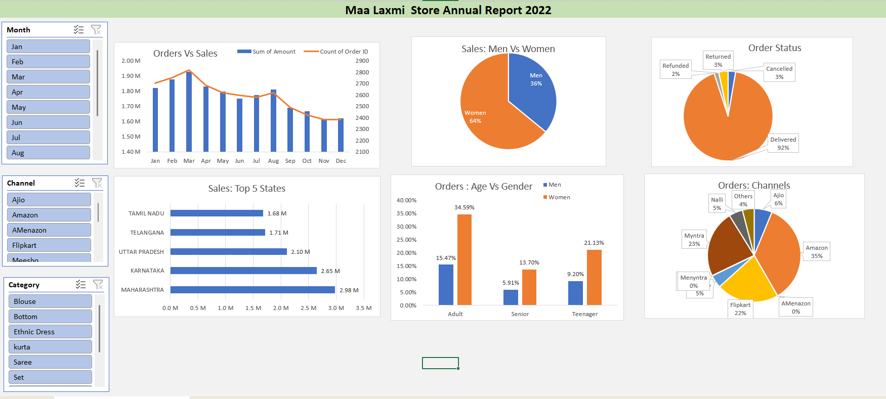

# 📊 Maa Laxmi Store Sales Dashboard (Excel)



## 🔍 Overview
Interactive Excel dashboard analyzing **Maa Laxmi Store's 2022 retail sales** across channels, states, categories, and customer segments.

---

## 🎯 Problem
No centralized view to track → **Sales | Customers | Channels | Order Status | Regional Performance**

---

## 📁 Dataset
**File:** Maa Laxmi Store Data Analysis.xlsx  
**Records:** ~2300+ | **Year:** 2022  

**Columns:**  
Gender | Age | Age Group | Month | Status | Channel | Category | Size | Qty | Amount | City  

---

## 🛠️ Tools
**Excel:** Pivot Tables | Charts | Slicers | Data Cleaning | Dashboarding  

---

## 📊 Dashboard Insights
- 👩 Women contribute **~60%+ sales**  
- 🛒 **Amazon & Myntra** are top channels  
- ✅ **~90% orders delivered**  
- 📍 Top states: Maharashtra | Karnataka | UP  
- 👥 Adults = highest buyers  

---

## 🎛️ Filters
Month | Channel | Category  

---

## 🚀 Usage
Download → Open Excel → Dashboard Sheet → Use slicers  

---

## 📂 Structure
```
maa-laxmi-sales-dashboard-excel/
├── images/dashboard.png
├── Maa Laxmi Store Data Analysis.xlsx
├── README.md
└── LICENSE
```

---

## 💡 Skills
EDA | Data Cleaning | Visualization | Dashboard Design | Business Insights  

---

⭐ If you found this useful, give it a star!
